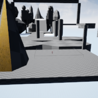

## PLATFORMER BLUEPRINT - UNREAL ENGINE 4

The purpose of the project is to build a platform game in the Unreal Engine 4.
The player should go through a hastily ending mode level. 
To validate, he must pass an end-of-level finish line.

## AUTHORS
LUANDA Osvaldo Bento - (o.luanda@student.isartdigital.com)
DECHAUX Yann        -   (y.dechaux@student.isartdigital.com)

## FEATURES
- Blueprint : the Blueprint Visual Scripting system in Unreal Engine is a complete gameplay scripting system based 
	on the concept of using a node-based interface to create gameplay elements from within Unreal Editor.
	As with many common scripting languages, it is used to define object-oriented (OO) classes or objects in the engine.
- Level Design : 
	It also allows us to work on our level design skills.
	Our current game world [PlatFormer/Content/StarterContent/Maps/PlatScene.umap]
	was made only with cubes, cylinders, cones and spheres.
	
	 
	

## SCENE

## PLAYER - CONTROLS
- A/Left - D/Right : Left/Right
- W/Up - S/Down : Forward/Backward
- Space : Jump
- Mouse : Rotation

## SCENE - CONTROLS
- K : Switch to First Person Camera/ Third Person Camera 
- ESCAPE     : Quit the apllication

## BIBLIOGRAPHIE
- https://docs.unrealengine.com/latest/INT/Engine/Blueprints/
- http://romeroblueprints.blogspot.fr/
- https://docs.unrealengine.com/4.27/en-US/InteractiveExperiences/Physics/Collision/Overview/
